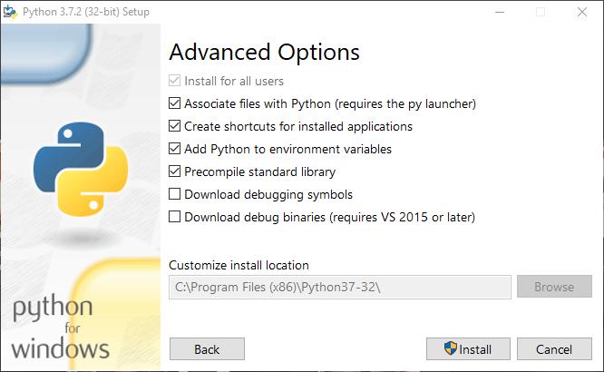

.. _installation:

Installation
============

For the development of python scripts using pycatia it's recommended you follow
the steps detailed below.

To run pre-existing scripts windows builds are :ref:`available<windows_builds>`

The Short Version
-----------------

This assumes python 3.6 or later is already installed and you know how and
when (all the time really) to use `virtual environments <https://docs.python.org/3/tutorial/venv.html>`_.

To install from `pypi <https://pypi.org/>`_::

    pip install pycatia

To get the latest development version from github::

    git clone https://github.com/evereux/pycatia.git
    # install pycatia requirement
    pip install -r requirements\requirements.txt

 To upgrade your current installed version::

    pip install pycatia --upgrade

The Long Version
----------------

It's unlikely that the pycatia end user will have administrator access to their
workstation. If that is the case you'll need to get someone with the appropriate
permissions to install python and the virtualenv module.

Installing Python
~~~~~~~~~~~~~~~~~

* Download python 3 (3.9 or later) from `python.org <https://www.python.org/downloads/>`_.

* Install python. Ensure to check the box to add python to environment variables.

* Install virtualenv for python. From the administrator command prompt run the
  following::

    python -m pip install virtualenv

Create The Virtual Environment
~~~~~~~~~~~~~~~~~~~~~~~~~~~~~~

The virtual environment allows you to install python packages in a sand boxed
environment away from the python installation itself.

* Create a new directory where you'll be creating your pycatia scripts. For
  this example this will be `c:\\Users\\<username>\\python\\pycatia-scripts`

* Change directory into this folder::

    cd c:\Users\<username>\python\pycatia-scripts

* Create the virtual environment::

    python -m virtualenv env

* Activate the virtual environment::

    env\Scripts\Activate

You should see the command prompt change to something like this::

    (env) c:\Users\<username>\python\pycatia-scripts>

* Install pycatia::

    python -m pip install pycatia

All done!

.. note::

    pycatia scripts will need this virtual env **activated** prior to running.

Confirm Successful Install

.. warning::
    Starting the CATIA V5 session is important!

* Start a CATIA V5 session.

* Open the CMD prompt and activate the virtual environment if you haven't already
  done so.

* Type `python`. You will then enter the python interpreter.

.. code::

    (env) C:\Users\<username>\python\pycatia-scripts>python
    Python 3.6.7 (v3.6.7:6ec5cf24b7, Oct 20 2018, 13:35:33) [MSC v.1900 64 bit (AMD64)] on win32
    Type "help", "copyright", "credits" or "license" for more information.

* Now import the catia application object.

.. code-block:: python

    from pycatia import catia
    caa = catia()
    help(caa)
    # q to quit help
    # open a new .CATPart
    documents = caa.documents
    documents.add('Part')

* To exit the python interpreter.

.. code-block:: python

    exit()

.. warning::

    If there are no error messages and you don't see a new CATPart ensure you
    don't have any hidden CATIA / CNEXT processes running in task manager.

.. warning::

    Sometimes the COM object isn't registered properly when CATIA is installed.
    If the above isn't working you may need to re-install.
 
.. note::
     for portable Catia,Catia without installation:
     
* run command promt
     
* go to dir: *CATIA_DIR*/Bxx/win_b64/code/bin/
    * Bxx-your catia release
    * win_64 for x64 system
    * intel_a for x32 system
    
run::

    cnext.exe /regserver -env Your_enviroment_file -direnv Directory_with_your_enviroment_file

for example::

Your_enviroment file is ``CATIA_P3.V5-6R2019.B29``

Directory_with_your_enviroment_file is ``h:\catia\CatEnv``
     
 
    

