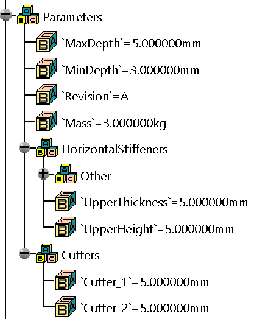
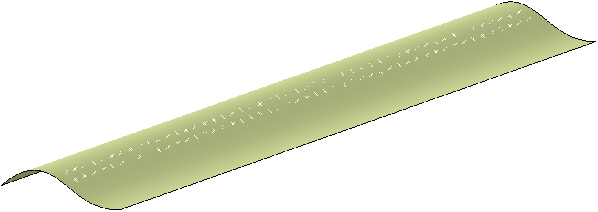
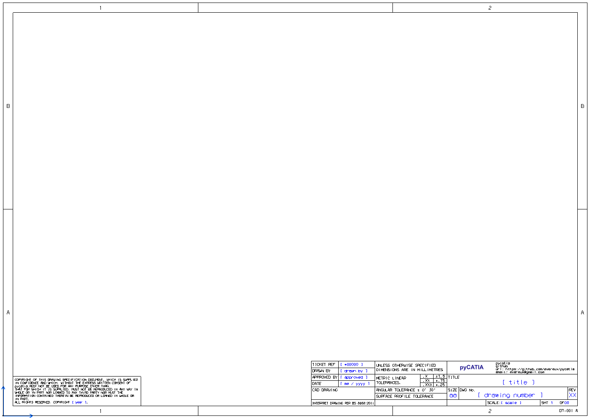
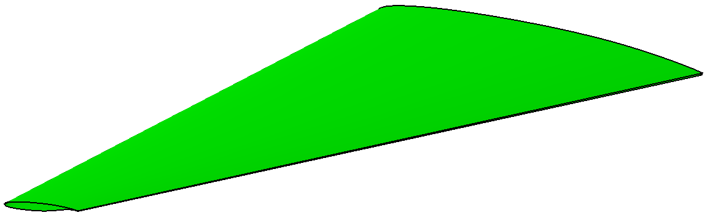

User Scripts
============

User created scripts that are more advanced than the :ref:`examples`.

Index
-----

:ref:`CREATE PARAMETERS FROM YAML<Create Parameters From YAML>`

:ref:`CREATE LINES NORMAL TO SURFACE<Create Lines Normal To Surface>`

:ref:`DRAWING TEMPLATE<Drawing Template>`

:ref:`RENAME INSTANCES IN PRODUCT<Rename Instances In Product>`

:ref:`WING SURFACE FROM NACA PROFILE<Wing Surface From Naca Profile>`

CREATE PARAMETERS FROM YAML
---------------------------

Creates parameter sets and parameters based on the contents of a YAML file.

Great for creating complex parameter structures.

See script header for more information.

`Create parameters from YAML <https://github.com/evereux/pycatia/blob/master/user_scripts/create_parameters_from_yaml.py>`_

CREATE LINES NORMAL TO SURFACE
------------------------------

Creates lines normal to surface using all the points in the selected Geometrical
Set.

Image showing surface and points.

Image showing lines after script has been run.

See script header for more information.

`Create Lines Normal To Surface <https://github.com/evereux/pycatia/blob/master/user_scripts/create_lines_normal_to_surface.py>`_

DRAWING TEMPLATE
----------------

Creating a drawing template in the background view.

See script header for more information.

`Drawing Template <https://github.com/evereux/pycatia/blob/master/user_scripts/drawing_template.py>`_

RENAME INSTANCES IN PRODUCT
---------------------------

Sequentially renames the instances of products within a selected product.

See script header for more information.

`Rename Instance In Product <https://github.com/evereux/pycatia/blob/master/user_scripts/rename_instances_in_product.py>`_

WING SURFACE FROM NACA PROFILE
------------------------------

Reads the contents of the NACA dat file `sc20610.dat` to create a wing surface.

See script header for more information.

`Wing Surface From Naca Profle <https://github.com/evereux/pycatia/blob/master/user_scripts/wing_surface_from_naca_profile.py>`_
