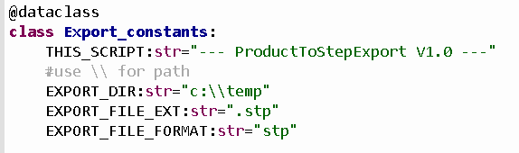

Convert all parts to neutral file format
----------------------------------------

This script convert all parts from product and sub product to step file.

You must change static variable to point place and file format.

Configuration
~~~~~~~~~~~~~

.. table:: Variable to cofiguration
==================  ======================
Variable            Description
==================  ======================
EXPORT_DIR          Directory to export

EXPORT_FILE_EXT     Extension for new file

EXPORT_FILE_FORMAT  File format to export
==================  ======================

By default, the script exports all unique catpart to step files
in the directory c:\temp.Directory must be exist!

